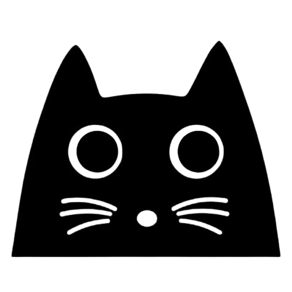

<p align="center">
  
</p>

<h1 align="center">CopyCat SOP Mapper</h1>

<p align="center">
  A Chrome extension that records your browser activity and exports it as a <strong>HAR file</strong> and <strong>CopyCat-compatible workflow steps</strong> — so you can build automations faster.
</p>

<p align="center">
  
  
  
</p>

---

## What It Does

Click **Start**, use a web app normally, click **Stop**. The extension captures everything happening under the hood and gives you two downloadable files:

| File | Format | What's Inside |
|------|--------|---------------|
| `sop-capture.har` | [HAR 1.2](http://www.softwareishard.com/blog/har-12-spec/) | Every XHR/fetch request — method, URL, status, headers, timing |
| `sop-steps.json` | CopyCat JSON | Ordered workflow steps with XPaths, ready for automation |

### Captured Interactions

- **Navigations** — URL changes recorded as `go_to_url` steps
- **Clicks** — element XPath + tag/text/id metadata as `click_element` steps
- **Text input** — debounced keystrokes with final value as `input_text` steps
- **Dropdowns** — select changes as `select_dropdown_option` steps
- **XHR / Fetch** — all network requests (with analytics/tracking noise filtered out) as `call_api` steps

---

## Installation

> No build step. No dependencies. Just load the folder.

1. Clone this repo (or download the ZIP):
   ```bash
   git clone https://github.com/CopyCatAI/web-sop-mapper.git
   ```
2. Open Chrome and navigate to **`chrome://extensions/`**
3. Enable **Developer mode** (toggle in the top-right corner)
4. Click **Load unpacked**
5. Select the `web-sop-mapper` folder
6. Pin the extension in your toolbar for easy access

<p align="center">
  
</p>

---

## Usage

1. Click the **CopyCat SOP Mapper** icon in your toolbar
2. Click **Start Recording**
3. Use the web app you want to map — browse, click, type, navigate
4. Click **Stop & Download**
5. Two files download automatically:
   - `sop-capture.har`
   - `sop-steps.json`

The popup shows live stats while recording: XHR count, navigations, clicks, and inputs.

---

## Output Format

### HAR File

Standard HAR 1.2 — importable into Chrome DevTools (Network → Import HAR), Postman, Charles Proxy, or any HAR viewer.

### CopyCat Steps

Uses the same function schema as the [CopyCat](https://github.com/CopyCatAI) automation engine:

```json
{
  "name": "Recorded SOP",
  "created": "2025-03-11T10:30:00.000Z",
  "steps": [
    {
      "step": 1,
      "function": "go_to_url",
      "display_name": "Go to URL",
      "category": "navigation",
      "params": { "url": "https://app.example.com/dashboard" }
    },
    {
      "step": 2,
      "function": "click_element",
      "display_name": "Click Element",
      "category": "interaction",
      "params": { "xpath": "//*[@id=\"new-patient-btn\"]" },
      "meta": { "tag": "button", "text": "New Patient", "id": "new-patient-btn" }
    },
    {
      "step": 3,
      "function": "input_text",
      "display_name": "Type Text",
      "category": "interaction",
      "params": { "xpath": "//input[@name=\"firstName\"]", "text": "John" },
      "meta": { "tag": "input", "inputType": "text", "name": "firstName" }
    },
    {
      "step": 4,
      "function": "call_api",
      "display_name": "API Call (observed)",
      "category": "external",
      "params": { "url": "https://api.example.com/patients", "method": "POST" },
      "response": { "status": 201 }
    }
  ]
}
```

### Supported CopyCat Functions

| Function | Category | Description |
|----------|----------|-------------|
| `go_to_url` | navigation | Page navigation |
| `click_element` | interaction | Click with XPath |
| `input_text` | interaction | Type text into a field |
| `select_dropdown_option` | interaction | Select from a dropdown |
| `call_api` | external | Observed XHR/fetch request |

---

## Noise Filtering

Network requests to the following are automatically filtered out:

- Google Analytics / GTM / DoubleClick
- Facebook Pixel
- Hotjar, Sentry, Segment
- Web fonts (`.woff`, `.woff2`, `.ttf`)
- Favicons
- Chrome extension internal requests

---

## Project Structure

```
web-sop-mapper/
├── manifest.json       # Chrome Extension Manifest V3
├── background.js       # Service worker — network capture, HAR + steps generation
├── content.js          # Content script — click/input/select tracking with XPath
├── popup.html          # Extension popup UI
├── popup.js            # Popup logic — start/stop, live stats, file downloads
├── icons/
│   ├── logo.png        # CopyCat logo
│   ├── logo-wide.png   # CopyCat logo (wide)
│   ├── icon16.png      # Toolbar icon
│   ├── icon48.png      # Extensions page icon
│   └── icon128.png     # Chrome Web Store icon
├── LICENSE
├── .gitignore
└── README.md
```

---

## Contributing

1. Fork the repo
2. Create a feature branch (`git checkout -b feature/my-feature`)
3. Commit your changes (`git commit -m 'Add my feature'`)
4. Push to the branch (`git push origin feature/my-feature`)
5. Open a Pull Request

---

## License

MIT — see [LICENSE](LICENSE) for details.

---

<p align="center">
  Built by <a href="https://github.com/CopyCatAI">CopyCat</a>
</p>
